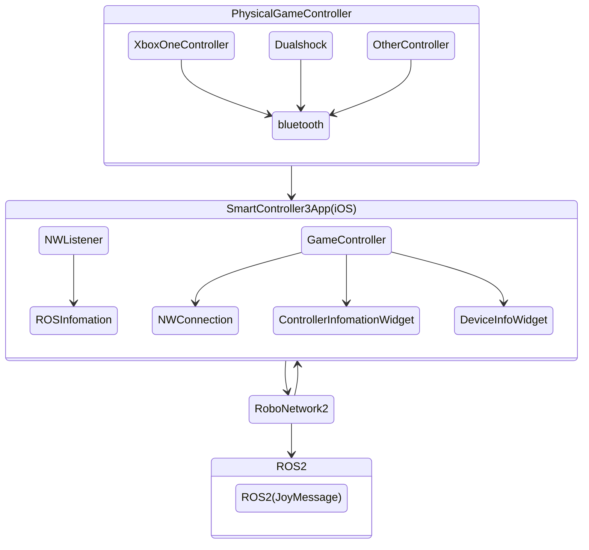
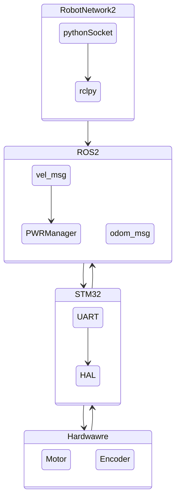

# 2022Robokon A team

## システム概要図-1

コントローラー周り

```mermaid
stateDiagram-v2
  PhysicalGameController --> SmartController3App(iOS)
  SmartController3App(iOS) --> RoboNetwork2
  RoboNetwork2 --> SmartController3App(iOS)
  RoboNetwork2 --> ROS2
  
  state PhysicalGameController{
  XboxOneController --> bluetooth
  Dualshock --> bluetooth
  OtherController --> bluetooth
  }

  state SmartController3App(iOS){
  NWListener --> ROSInfomation
  GameController --> NWConnection
  GameController --> ControllerInfomationWidget
  GameController --> DeviceInfoWidget
  
  }
  state ROS2{
  ROS2(JoyMessage)
  }
 
  

```

## システム概要図-2
ロボット動作

```mermaid
stateDiagram-v2
  RobotNetwork2 --> ROS2
  ROS2 --> STM32
  STM32 --> ROS2
  STM32 --> Hardwawre
  Hardwawre --> STM32

  state RobotNetwork2{
    pythonSocket --> rclpy
  }
  
  state ROS2{
  vel_msg --> PWRManager
  odom_msg
  }
  
  state STM32{
    UART --> HAL
  }
  
  state Hardwawre{
    Motor
    Encoder
  }

```

## システム概要図-3
センサー
