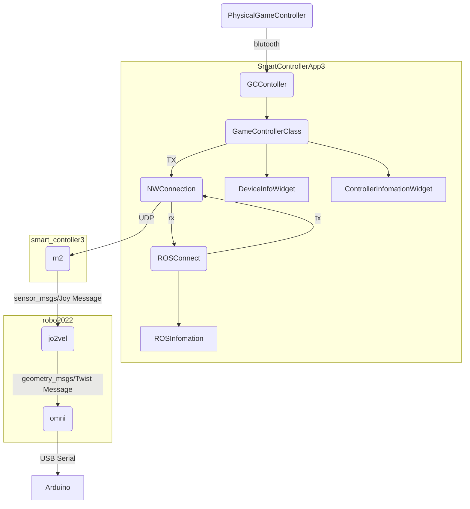
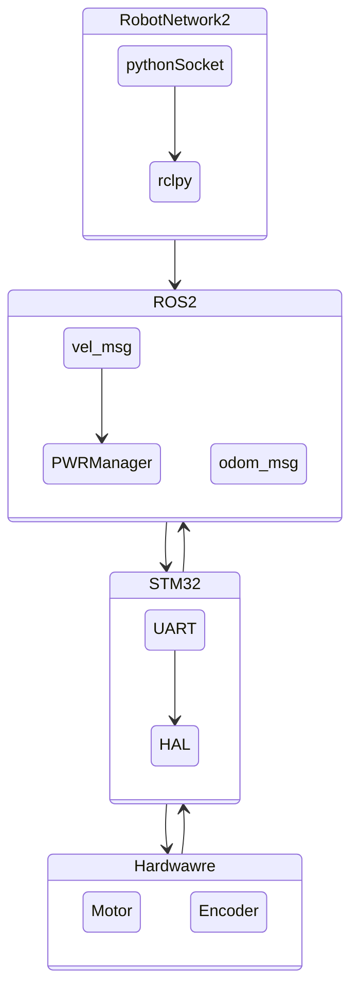

# 2022Robokon A team
## 開発環境
- Jetson AGX Xavier
  - Jetpack 5.0.1
  - ROS2 Foxy
- MacBook Pro
  - M1 Max
  - Docker(Ubuntu 20.04)
  - ROS2 Foxy
- Surface Go
  - Ubuntu 22.04LTS
  - ROS2 Humble
- Jetson Nano
  - Jetpack 4.6.1
  - ROS2 Dashing
  
## 本番環境(予定)
- Jetson AGX Xavier
  - Jetpack 5.0.1
  - ROS2 Foxy

- Jetson Nano(Second Support)
  - Jetpack 4.6.1
  - ROS2 Dashing

  

## システム概要図-1

コントローラー周り

## システム概要図-2
ロボット動作

## システム概要図-3
センサー
