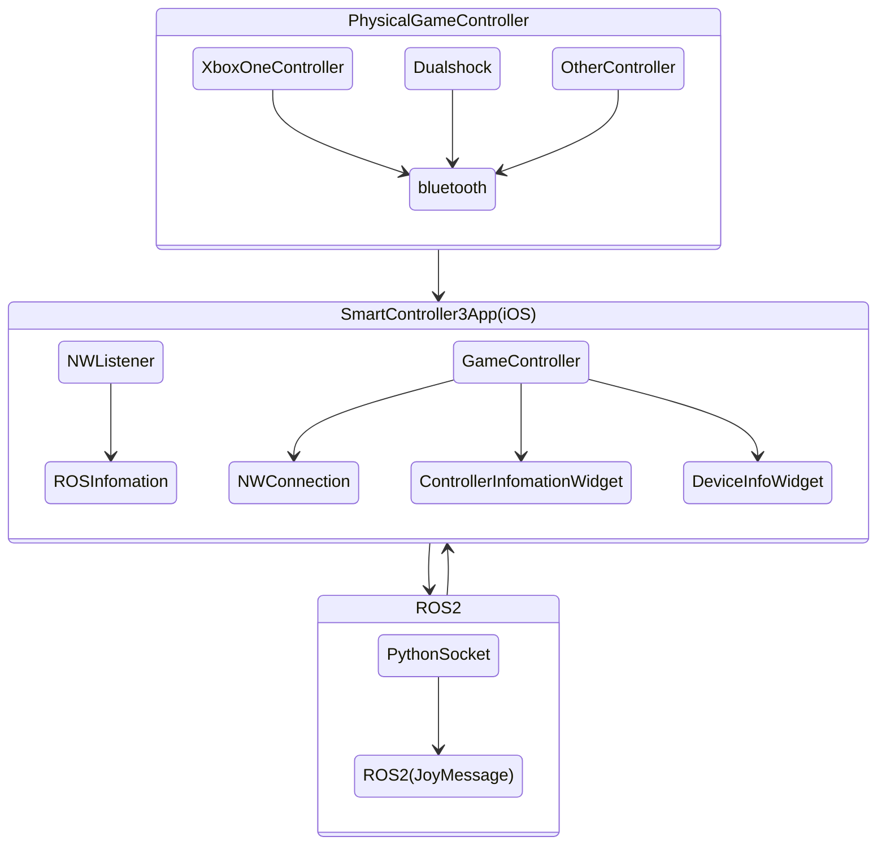

# 2022Robokon A team

## システム概要図-1

コントローラー周り

```mermaid
stateDiagram-v2
  PhysicalGameController --> SmartController3App(iOS)
  SmartController3App(iOS) --> ROS2
  ROS2 --> SmartController3App(iOS)
  
  state PhysicalGameController{
  XboxOneController --> bluetooth
  Dualshock --> bluetooth
  OtherController --> bluetooth
  }

  state SmartController3App(iOS){
  NWListener --> ROSInfomation
  GameController --> NWConnection
  GameController --> ControllerInfomationWidget
  GameController --> DeviceInfoWidget
  
  }
  state ROS2{
  PythonSocket --> ROS2(JoyMessage)
  }
 
  

```

## システム概要図-2
ロボット定義&動作定義

## システム概要図-3
シュミレーション
