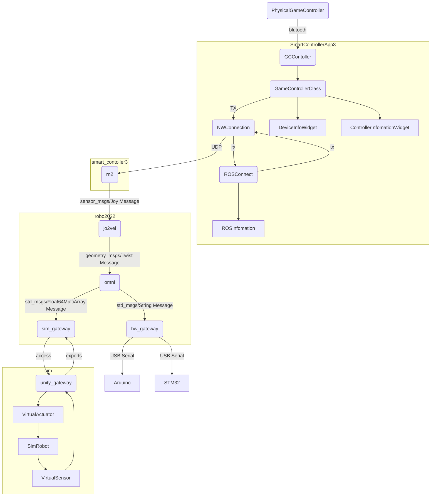
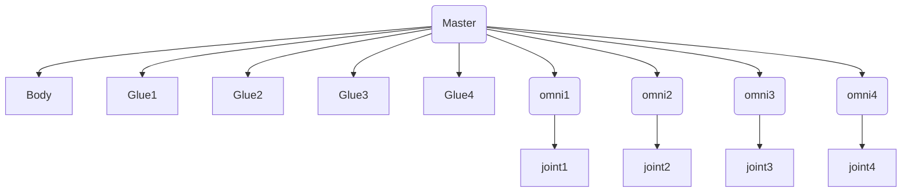
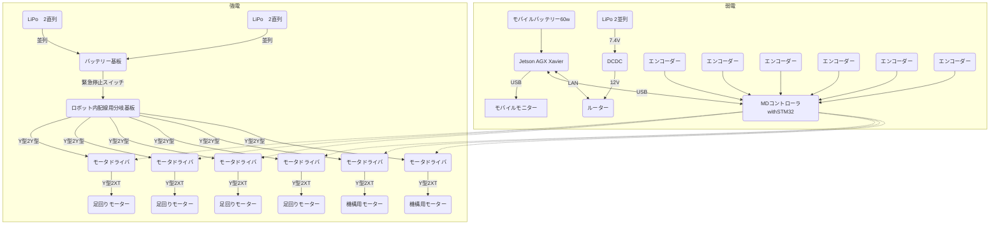
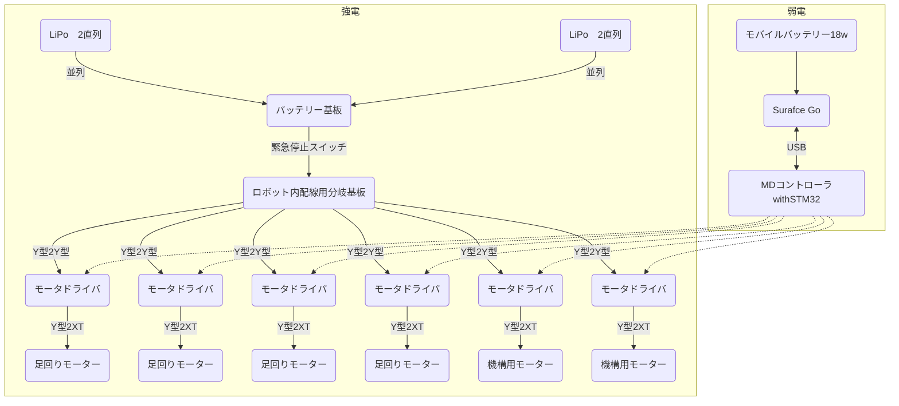
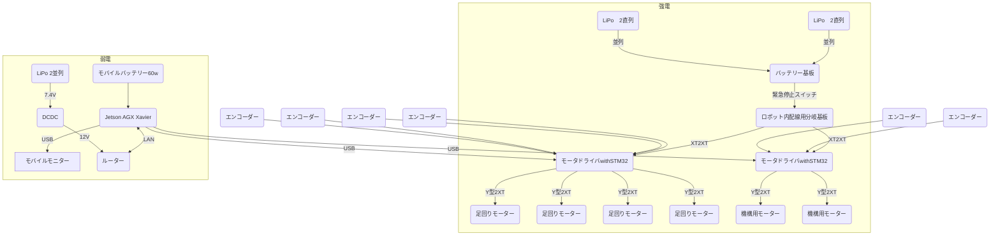

# 2022Robokon A team

## システム概要図

```mermaid
flowchart TD

id1(PhysicalGameController) -- blutooth --> id2(GCContoller)
subgraph SmartControllerApp3
id2 --> id3(GameControllerClass)
id3 -- TX --> id4(NWConnection)
id3 --> DeviceInfoWidget
id3 --> ControllerInfomationWidget
id5(ROSConnect) -- tx --> id4
id4 -- rx --> id5
id5 --> ROSInfomation
end

subgraph smart_contoller3
id4 -- UDP --> id6(rn2)
end

subgraph robo2022
id6 -- sensor_msgs/Joy Message --> id7(jo2vel)
id7 -- geometry_msgs/Twist Message --> id8(omni)
id8 -- std_msgs/Float64MultiArray Message --> id9(sim_gateway)
id8 -- std_msgs/String Message --> id10(hw_gateway)

end
subgraph sim
id9 -- access --> id11(unity_gateway)
id11 -- exports --> id9
id11 --> VirtualActuator
VirtualSensor --> id11

SimRobot --> VirtualSensor
VirtualActuator --> SimRobot

end
id10 -- USB Serial --> Arduino
id10 -- USB Serial --> STM32


```

## SIM
### SimRobot構造
足回り

```mermaid
flowchart TD
id1(Master) --> Body
id1 --> Glue1
id1 --> Glue2
id1 --> Glue3
id1 --> Glue4
id1 --> id2(omni1)
id1 --> id3(omni2)
id1 --> id4(omni3)
id1 --> id5(omni4)

id2 --> joint1
id3 --> joint2
id4 --> joint3
id5 --> joint4

```

## 電気配線

パターン N

```mermaid
flowchart TD
subgraph 強電
id1(LiPo　2直列) -- 並列 --> id3(バッテリー基板)
id2(LiPo　2直列) -- 並列 --> id3
id3 -- 緊急停止スイッチ --> id4(ロボット内配線用分岐基板)
id4 -- Y型2Y型 --> id5(モータドライバ)
id4 -- Y型2Y型 --> id6(モータドライバ)
id4 -- Y型2Y型 --> id7(モータドライバ)
id4 -- Y型2Y型 --> id8(モータドライバ)
id4 -- Y型2Y型 --> id9(モータドライバ)
id4 -- Y型2Y型 --> id10(モータドライバ)

id5 -- Y型2XT --> id11(足回りモーター)
id6 -- Y型2XT --> id12(足回りモーター)
id7 -- Y型2XT --> id13(足回りモーター)
id8 -- Y型2XT --> id14(足回りモーター)
id9 -- Y型2XT --> id15(機構用モーター)
id10 -- Y型2XT --> id16(機構用モーター)
end

subgraph 弱電
id17(モバイルバッテリー60w) --> id18(Jetson AGX Xavier)
id18 -- USB --> モバイルモニター
id18 <-- USB --> id19(MDコントローラwithSTM32)
id18 <-- LAN --> id20(ルーター)
id21(LiPo 2並列) -- 7.4V --> id22(DCDC)
id22 -- 12V --> id20

id19 .-> id5
id19 .-> id6
id19 .-> id7
id19 .-> id8
id19 .-> id9
id19 .-> id10

id23(エンコーダー) --> id19
id24(エンコーダー) --> id19
id25(エンコーダー) --> id19
id26(エンコーダー) --> id19
id27(エンコーダー) --> id19
id28(エンコーダー) --> id19

end
```

パターン B

```mermaid
flowchart TD
subgraph 強電
id1(LiPo　2直列) -- 並列 --> id3(バッテリー基板)
id2(LiPo　2直列) -- 並列 --> id3
id3 -- 緊急停止スイッチ --> id4(ロボット内配線用分岐基板)
id4 -- Y型2Y型 --> id5(モータドライバ)
id4 -- Y型2Y型 --> id6(モータドライバ)
id4 -- Y型2Y型 --> id7(モータドライバ)
id4 -- Y型2Y型 --> id8(モータドライバ)
id4 -- Y型2Y型 --> id9(モータドライバ)
id4 -- Y型2Y型 --> id10(モータドライバ)

id5 -- Y型2XT --> id11(足回りモーター)
id6 -- Y型2XT --> id12(足回りモーター)
id7 -- Y型2XT --> id13(足回りモーター)
id8 -- Y型2XT --> id14(足回りモーター)
id9 -- Y型2XT --> id15(機構用モーター)
id10 -- Y型2XT --> id16(機構用モーター)
end

subgraph 弱電
id17(モバイルバッテリー18w) --> id18(Surafce Go)
id18 <-- USB --> id19(MDコントローラwithSTM32)

id19 .-> id5
id19 .-> id6
id19 .-> id7
id19 .-> id8
id19 .-> id9
id19 .-> id10


end
```

パターン X

```mermaid
flowchart TD
subgraph 強電
id1(LiPo　2直列) -- 並列 --> id3(バッテリー基板)
id2(LiPo　2直列) -- 並列 --> id3
id3 -- 緊急停止スイッチ --> id4(ロボット内配線用分岐基板)
id4 -- XT2XT --> id5(モータドライバwithSTM32)
id4 -- XT2XT --> id6(モータドライバwithSTM32)

id5 -- Y型2XT --> id11(足回りモーター)
id5 -- Y型2XT --> id12(足回りモーター)
id5 -- Y型2XT --> id13(足回りモーター)
id5 -- Y型2XT --> id14(足回りモーター)
id6 -- Y型2XT --> id15(機構用モーター)
id6 -- Y型2XT --> id16(機構用モーター)
end

subgraph 弱電
id17(モバイルバッテリー60w) --> id18(Jetson AGX Xavier)
id18 -- USB --> モバイルモニター
id18 <-- LAN --> id20(ルーター)
id21(LiPo 2並列) -- 7.4V --> id22(DCDC)
id22 -- 12V --> id20

id18 -- USB --> id5
id18 -- USB --> id6

end


id23(エンコーダー) --> id5
id24(エンコーダー) --> id5
id25(エンコーダー) --> id5
id26(エンコーダー) --> id5
id27(エンコーダー) --> id6
id28(エンコーダー) --> id6
```
