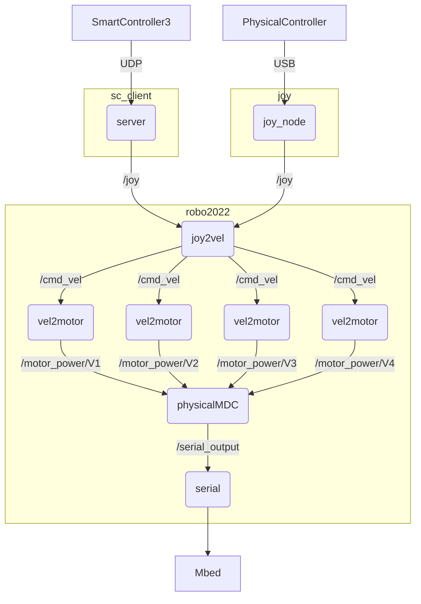
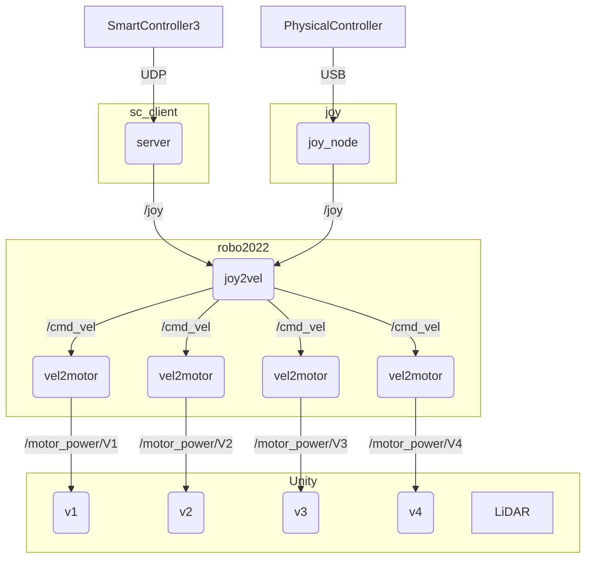

## Node architecture (real version)

```mermaid
flowchart TD

subgraph robo2022
id1(joy2vel) -- /cmd_vel --> id2(vel2motor)

id1 -- /cmd_vel --> id3(vel2motor)
id1 -- /cmd_vel --> id4(vel2motor)
id1 -- /cmd_vel --> id5(vel2motor)

id2 -- /motor_power/V1 --> id6(physicalMDC)
id3 -- /motor_power/V2 --> id6
id4 -- /motor_power/V3 --> id6
id5 -- /motor_power/V4 --> id6
id6 -- /serial_output --> id7(serial)
end

subgraph sc_client
id8(server) -- /joy --> id1
end

subgraph joy
id9(joy_node) -- /joy --> id1
end

SmartController3 -- UDP --> id8
PhysicalController -- USB --> id9
id7 --> Mbed

```

## Node architecture (sim version)

```mermaid
flowchart TD

subgraph robo2022
id1(joy2vel) -- /cmd_vel --> id2(vel2motor)

id1 -- /cmd_vel --> id3(vel2motor)
id1 -- /cmd_vel --> id4(vel2motor)
id1 -- /cmd_vel --> id5(vel2motor)
end

subgraph sc_client
id10(server) -- /joy --> id1
end

subgraph joy
id11(joy_node) -- /joy --> id1
end

SmartController3 -- UDP --> id10
PhysicalController -- USB --> id11

subgraph Unity
id2 -- /motor_power/V1 --> id6(v1)
id3 -- /motor_power/V2 --> id7(v2)
id4 -- /motor_power/V3 --> id8(v3)
id5 -- /motor_power/V4 --> id9(v4)
LiDAR
end


```

